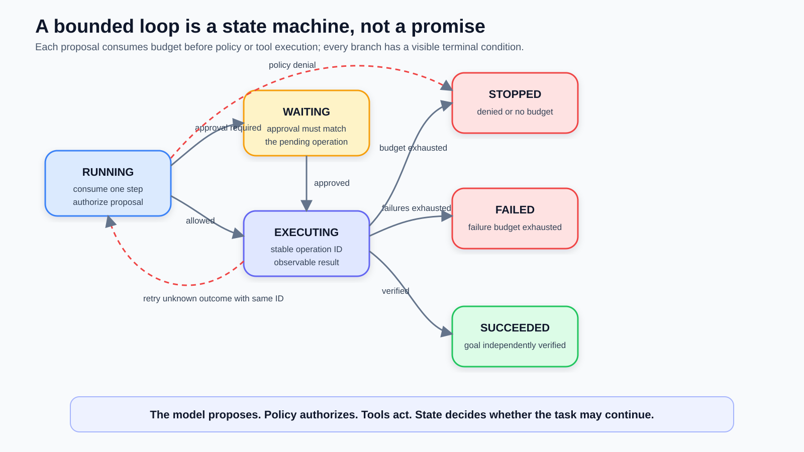
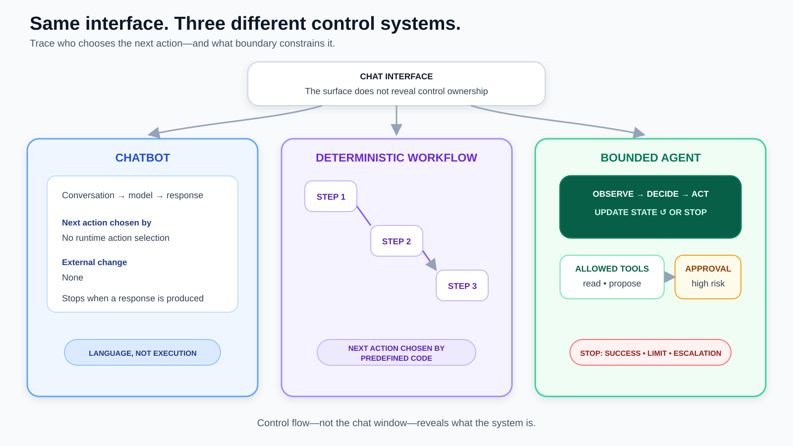

# What Makes an AI Agent Different from a Chatbot?

*Part 1 of Agentic AI Engineering: define the control boundary before you add tools, memory, or autonomy.*

**Series navigation:** Previous: Course index (this is the first lesson) | Course index: Agentic AI Engineering | Next: Part 2 — The Six Configuration Surfaces of an Agent

*Disclosure: This draft was developed with AI assistance. Its technical claims,
examples, and sources were checked during editorial preparation; the named author
remains responsible for the final publication.*

Consider a support demo that says it has “resolved” a customer’s delivery problem. The response is polished: it summarizes the complaint, apologizes, and says a replacement has been arranged.

Nothing had actually happened.

But the system has no order lookup, no replacement tool, and no durable record of the conversation. It is a chatbot performing the language of action. The failure is not weak prose. The failure is confusing a convincing response with an executed task.

That distinction is the foundation of this course. An agent is not a chatbot with a more ambitious system prompt. It is a system allowed to choose and perform actions inside an explicit boundary, while carrying enough state to decide what should happen next.

In this article, you will use control flow—not marketing language—to separate a
chatbot, a deterministic workflow, and a bounded agent. You will leave with a
boundary card that can be reviewed before anyone connects a model to a real tool.

The useful engineering question is therefore not, “Does this feel agentic?” It is: **What can this system observe, decide, change, remember, and stop?**

## Reading Path

If you are new to agents, read the article in order and keep the five-part loop
beside you during the worked example. If you already build model-backed systems,
start with **Definitions Vary—Declare Yours**, then examine the state machine,
failure table, and design-choice matrix. The exercise converts all three paths
into the same deliverable: a boundary card that Part 2 will make versionable.

## Learning Outcomes

By the end of this lesson, you will be able to:

1. Distinguish a chatbot, a deterministic workflow, and an agent by their control flow rather than their interface.
2. Trace an agent through a bounded loop of observation, decision, action, state update, and stopping.
3. Design a one-page boundary specification that makes autonomy reviewable before implementation.

## Before You Start

You do not need an agent framework for this lesson. You should be comfortable
with functions, API calls, and the difference between reading and changing data.

Before continuing, recall one automation you have built or used. Who selected its
next step: fixed application code, a human, or a model at runtime? Keep that
example in mind; you will classify it again after learning the bounded-loop model.

## A Chat Interface Tells You Almost Nothing

Three systems can share the same chat window and still have completely different architectures.

A **chatbot** primarily turns conversation history into a response. It may answer questions, transform text, or suggest a next step. If it cannot affect another system, its output remains advice or language.

A **workflow** performs actions, but its route is mostly decided in advance. A rule might say: if an invoice is overdue, send a reminder; after seven days, create a collection task. The workflow acts, yet the designer—not a model at runtime—selected the sequence.

An **agent** uses a model or another policy component to choose among permitted actions based on the current situation. It observes a task, selects a tool, reads the result, updates its working state, and decides whether to act again or stop.

These are not prestige levels. A workflow is often the better design when the rules are stable and the cost of improvisation is high. A chatbot is often sufficient when the user only needs explanation. Calling everything an agent hides the exact control decision that deserves review.

There is no single universally accepted definition that cleanly separates every
agent from every workflow. Anthropic distinguishes workflows, whose paths are
predefined in code, from agents, whose models dynamically direct their processes
and tool use. OpenAI's Agents SDK describes an agent through instructions, tools,
and optional runtime behavior such as guardrails and handoffs. Those descriptions
overlap without being identical, so this course uses an operational definition
that can be traced in code:

> An agent is a bounded software system that chooses its next action from an allowed set, observes the result, updates task state, and repeats until a stop condition is met.

The word **bounded** does most of the safety work in that sentence.

## Definitions Vary—Declare Yours

Agent terminology changes depending on what a writer is trying to analyze. A
classical artificial-intelligence definition starts with an entity that perceives
an environment and acts on it. Chip Huyen uses that broad frame in *Agents* and
emphasizes the relationship between an environment, an available tool inventory,
and a model that plans. Under that definition, even a retrieval-augmented
generation system can be described as a simple agent because retrieval and
response generation are actions available inside its environment.

Anthropic draws a narrower engineering line. Its workflow follows paths selected
in code, while its agent lets a model direct the process and decide how tools are
used. That definition focuses attention on runtime control ownership rather than
on whether the system has components that could be called actions.

Neither framing is automatically wrong. They answer different questions. The
broad definition helps compare agent architectures across robotics,
reinforcement learning, and foundation-model systems. The narrower definition is
often more useful during an application review because it exposes where a
probabilistic model changes control flow.

Consider two retrieval systems. The first always embeds a query, retrieves five
documents from one index, and gives those documents to a model. Its sequence is
fixed even though retrieval is a tool-like action. This course classifies it as
a workflow. The second can ask for clarification, choose keyword or vector
search, change filters after inspecting results, and stop when evidence remains
insufficient. This course classifies it as a bounded agent because the model can
select a different next action after each observation.

The practical lesson is not to win a naming argument. Put your operational
definition in the design document, then show the control graph. A reviewer should
be able to tell which transitions are fixed, which are selected by a model, and
which are rejected by application policy. If the diagram and trace are clear,
the label becomes less dangerous.

## Mental Model

Think of an agent as two layers. The inner layer is a five-part control loop:
observe, decide, act, update state, and stop. The outer layer is a boundary that
constrains observations, tools, persisted state, approvals, budgets, and stop
conditions. The model may choose inside that boundary; application code owns the
boundary itself.

This model gives you two review questions: **Who selects the next action?** and
**What prevents that choice from escaping its authority?** The first separates a
workflow from an agent. The second separates a bounded agent from an unsafe loop.

## The Five-Part Agent Loop

You can recognize an agent by tracing five responsibilities.

### 1. Observe

The system receives a goal plus relevant context. Later observations may include tool results, validation errors, approval decisions, or time and budget remaining. Observation is broader than reading the user’s last message.

### 2. Decide

The system chooses the next permitted move. That could be calling a search tool, asking the user for missing information, validating a draft, or finishing. The model is not merely composing text; it is influencing control flow.

### 3. Act

The chosen action crosses a boundary. A read-only action might fetch a file. A mutating action might create a ticket or update a record. The tool—not the model’s prose—performs the operation and returns a result.

### 4. Update state

The system records what matters for the next decision: completed steps, tool results, failed attempts, approvals, unresolved questions, or a compact task summary. Conversation history can be part of state, but state can also live in structured fields, files, or a database.

### 5. Stop

The loop ends because the goal is satisfied, the user must decide, an error is not recoverable, or a limit has been reached. A production agent needs stop conditions just as much as it needs tools. “Keep trying” is not a stop policy.

If one of these responsibilities is missing, name the missing piece instead of stretching the word agent. A model that proposes tool calls but never executes them is an assistant with action suggestions. A fixed sequence that cannot choose a different next step is a workflow. A loop with no bounded action set or stop rule is an incident waiting to happen.

## Turn the Boundary into a State Machine

The five-part loop is useful only if it can be represented as state and
transitions. Otherwise, “observe, decide, act” remains a story told after the run
rather than a contract enforced during it.

A minimal task state needs more than conversation messages. It should make the
goal, evidence, approval status, budgets, and terminal status independently
inspectable. The surrounding application—not the model—should own the transition
function.

The companion implementation makes those transitions executable. A caller
supplies a proposal, but `step` consumes the budget and asks policy for a
decision before it invokes a tool:

```python
def step(self, proposal):
    if self.state.remaining_steps <= 0:
        return self._stop("stopped", "step_budget_exhausted")

    self.state.remaining_steps -= 1
    decision, reason = self.policy.authorize(self.state, proposal)

    if decision == "deny":
        return self._stop("stopped", "policy_denied")
    if decision == "require_approval":
        self.state.status = "waiting_for_approval"
        self.state.pending_approval = proposal.logical_operation
        return self._record("approval_requested")

    operation_id = self.state.operation_id(proposal.logical_operation)
    result = self.tools[proposal.name](proposal.arguments, operation_id)
    return self._record("tool_completed", result=result)
```

The published excerpt omits error branches to keep the transition visible; the
[complete bounded state machine](../../examples/agentic-ai-engineering/part-01/bounded_agent.py)
handles reported tool failure, unknown mutation outcomes, matching approvals,
stable operation identifiers, and verified completion. Its tests are part of the
article evidence rather than an exercise left to the reader.

The important ownership boundaries are now executable:

- The model proposes an action; it does not authorize or execute it.
- Policy evaluates the authenticated actor, current task, and proposed
  parameters—not merely the tool name.
- The trace records the proposal and the policy decision before execution.
- A logical mutating operation receives the same idempotency key on every retry,
  so an unknown outcome can be investigated without creating a new write intent.
- Only the transition function changes durable task state.
- Completion requires verified evidence in state, not a model statement that the
  task is complete.

Those rules are **invariants**: conditions that must remain true across every
transition. For the access agent, useful invariants include “a ticket belongs to
the current employee,” “an approval refers to the current ticket version,” and
“a success status contains the access service's confirmation identifier.” An
agent can choose among actions, but it cannot choose to relax an invariant.

The state machine also makes waiting a real state. When manager approval is
needed, the system should persist `waiting_for_approval` and release compute. It
should not keep calling the model to rediscover that approval is missing. When an
approval event arrives, application code verifies its identity and version,
transitions the task back to `running`, and only then asks for another decision.



Figure 1: Budget is consumed before authorization. Denials and exhausted budgets
stop; repeated tool failures fail; approval pauses the run; and only an
independently verified goal succeeds.

## Boundaries Matter More Than Personality

Teams often start an agent design by polishing its role: “You are an expert operations analyst.” That may influence responses, but it does not establish the system’s authority.

A useful boundary specification answers five concrete questions:

- **Observation boundary:** What inputs and tool results may the agent see?
- **Action boundary:** Which tools may it call, with which parameter constraints?
- **State boundary:** What may persist across steps, sessions, or users?
- **Approval boundary:** Which actions require a human decision before execution?
- **Termination boundary:** What counts as success, failure, timeout, or escalation?

This turns “autonomy” from a mood into a contract. The agent may have freedom inside the contract, but the surrounding software owns authentication, authorization, validation, budgets, and audit records.

Treat tool output as input, not as authority. A web page, document, ticket, or
tool error can contain misleading instructions or malformed data. OWASP's prompt
injection guidance recommends validating tool calls against user permissions and
session context, restricting tool access by least privilege, and retaining human
approval for high-risk operations. The agent can reason about untrusted content,
but application controls must still decide what the tool is allowed to do.

## Worked Example

Imagine an internal support system that handles laptop-access requests. The user writes: “My laptop was replaced and I can’t access the analytics dashboard. Please fix it before the morning report.”

### Version A: the chatbot

The chatbot explains the usual access steps and drafts a message to IT. It may be helpful, but it cannot inspect identity records or change permissions. Its completion condition is “a useful response was produced.”

If it says, “Your access has been restored,” it is making an unsupported claim. The architecture gives it no evidence that the action occurred.

### Version B: the deterministic workflow

The workflow extracts the employee ID, checks whether the request matches a known access bundle, creates a ticket, and sends a confirmation. Each step is useful and real. However, the route was fixed by code. An exception such as a contractor account or a missing manager mapping follows a predefined error branch.

This may be exactly what the organization needs. Predictability is a feature.

### Version C: the bounded agent

The agent receives a goal and a deliberately small set of tools:

1. `lookup_employee` — read-only identity and employment status.
2. `inspect_access` — read-only current entitlements.
3. `create_access_ticket` — creates a proposed access request after approval.

The agent first looks up the employee. It notices that the replacement laptop is registered but the dashboard entitlement is missing. It inspects the standard bundle for that role and proposes `create_access_ticket`. Application policy classifies the ticket creation as a write, stores its logical operation, and changes the task to `waiting_for_approval` before the tool runs. It does **not** grant access directly because that action is outside its boundary.

After approval, a separate access-management service performs the grant. The agent reads the service result and reports either verified success or an explicit failure. If the employee record is ambiguous, it stops and asks for clarification. If a tool fails twice, it stops retrying and exposes the failure.

The chat window did not make Version C an agent. Runtime choice did: the system selected its next action after each observation. The boundary made that choice acceptable: read operations were allowed, the write operation created a proposal rather than a privilege grant, approval was mandatory, and retries were limited.

Here is the minimal state we would want to inspect during a run:

```yaml
goal: restore analytics access for employee E-1042
status: waiting_for_approval
completed_steps:
  - employee_verified
  - current_access_inspected
pending:
  operation: create_access_ticket
  logical_operation: ticket-E-1042
  requirement: manager_approval
attempts:
  inspect_access: 1
stop_reason: null
```

Notice what is absent: hidden claims of success. The state says what the system has evidence for and what still blocks completion.

### Read the Run as a Trace

A final answer is not enough to debug an agent. You need a trace that reconstructs
what the system knew, proposed, was permitted to do, observed, and changed. A
compact trace for the access example might look like this:

| Step | Observation | Proposed action | Policy result | State change |
|---:|---|---|---|---|
| 1 | Employee ID supplied | `lookup_employee(E-1042)` | Allow: read-only | Identity record attached |
| 2 | Employee and device match | `inspect_access(E-1042)` | Allow: read-only | Missing entitlement recorded |
| 3 | Entitlement is absent | `create_access_ticket(...)` | Require approval | Pending logical operation stored; status becomes waiting |
| 4 | Signed approval event arrives | Application resumes the pending operation | Approval identity and operation match | Status returns to running |
| 5 | Approved proposal is retried | `create_access_ticket(...)` | Allow with stable operation ID | Ticket `T-8821` recorded once |
| 6 | Access service reports completion | Finish | Allow only because confirmation exists | Goal satisfied |

The trace does not need to expose private chain-of-thought. It needs operational
facts: inputs made available, selected tool and parameters, authorization
decision, latency, result status, state transition, model/configuration version,
and correlation identifiers. These facts let an engineer ask whether the failure
originated in planning, policy, the tool, or state handling.

Observability should begin at the first implementation, not after deployment.
Chip Huyen's generative-AI platform analysis separates metrics, logs, and traces;
the same distinction applies here. Metrics reveal patterns such as rising denial
rates or step counts. Logs record discrete events. A trace connects events into
one task path. You need all three to move from “the agent behaved strangely” to
a testable failure hypothesis.

## Failure Modes Begin at Boundary Crossings

Long agent runs can compound small mistakes. The useful response is not merely a
smarter prompt; it is to identify where failure can enter and which component can
detect it.

| Failure | What the trace shows | Required control |
|---|---|---|
| The model selects a nonexistent tool | Proposal fails inventory validation | Reject before execution and count an invalid-action event |
| The tool exists but parameters target the wrong employee | Tool name is valid; task identity and arguments disagree | Validate parameters against authenticated task context |
| A ticket write times out after reaching the server | Client sees a timeout but server state is unknown | Query by idempotency key before retrying |
| An approval belongs to an older ticket revision | Approval identifier exists but version does not match | Bind approval to subject, action, parameters, and version |
| Retrieved text says to bypass policy | Untrusted content influences the proposal | Preserve content provenance and keep policy outside model context |
| The loop repeats a failing read | Step count and identical failure signature rise | Use retry budgets, backoff, and a terminal escalation state |
| The model declares success without confirmation | Finish is proposed while the success invariant is false | Make completion a deterministic state predicate |

The timeout case deserves special attention. A read can often be repeated. A
write may have succeeded even when the client did not receive the response.
Blindly retrying `create_access_ticket` could create duplicates; blindly assuming
success could hide a failure. Idempotency keys, operation-status lookup, and
explicit `outcome_unknown` states are how ordinary distributed-systems practice
protects the agent boundary. The AWS Builders' Library describes caller-provided
request identifiers as a way to make retry intent auditable and avoid duplicate
side effects; the service still has to define the idempotency contract correctly.

Agent failures are also not all model failures. Chip Huyen separates planning
failures from tool failures and efficiency failures. That distinction keeps
remediation honest. Better examples may reduce invalid action proposals, but they
will not repair a tool that returns the wrong employee record. A stricter schema
may catch malformed arguments, but it will not prove that a syntactically valid
employee ID is the correct one. Each component needs its own tests, and the
end-to-end evaluation must still verify the task outcome.

## When a Workflow Is the Better Design

Autonomy has a cost: more possible paths, more traces to evaluate, and more ways
for state and tools to disagree. Choose it only when runtime adaptation creates
enough value to justify that cost.

| Design question | Chatbot | Deterministic workflow | Bounded agent |
|---|---|---|---|
| Does the task change an external system? | No | Often | Often |
| Who chooses the next step? | No execution path | Application code | Model within policy |
| Are valid routes known in advance? | Not applicable | Mostly yes | No; observations change the route |
| Is deterministic replay important? | Response may vary | Strong fit | Requires traces and evaluation |
| Are consequences difficult to reverse? | Low operational effect | Prefer explicit code and approvals | Restrict to proposals or narrow, reversible actions |
| What justifies the complexity? | Language help | Reliable repeatable automation | Valuable adaptation across uncertain states |

Start with the simplest design that completes the reader's or user's job. Use a
chatbot when the output is advice. Use a workflow when routes and exceptions can
be enumerated without excessive complexity. Introduce model-directed control
only where observations meaningfully change the next action and fixed branching
would be brittle or impossible to maintain.

A hybrid is common. Code can own the outer workflow while a model handles one
bounded decision, such as classifying an exception or choosing among read-only
search strategies. This gives the model a narrow decision surface without
turning the entire business process into an open-ended loop. “Agent or workflow”
is not always a system-wide choice; it can be a choice at each control boundary.

## Visual Explanation



Figure 2: The interface can look identical while control ownership changes from
response generation, to fixed code, to model-directed action inside explicit
approval and stopping boundaries.

Read Figure 2 from left to right to choose an architecture. Use Figure 1 when the
right-hand system is justified: it shows the states and terminal branches that
the simpler comparison intentionally hides.

## Tested Environment

The companion state machine was executed with Python 3.12.13 on 2026-09-03. It
uses only the Python standard library. Run it from the repository root:

```bash
python -m unittest discover \
  -s medium/examples/agentic-ai-engineering/part-01 -v
python medium/examples/agentic-ai-engineering/part-01/bounded_agent.py
```

Seven tests pass. They verify read-only success, approval and resume, fail-closed
denial, tool-failure exhaustion, stable idempotency across an unknown outcome,
step-budget termination, and rejection of an unverified success. The demo emits
three JSON trace events: an allowed decision with seven steps remaining, a
completed lookup with operation ID `bb68d550f502f6d1`, and `goal_satisfied`.

This is still a boundary demonstration, not an identity or authorization
service. Production code must authenticate the actor, persist transitions
atomically, validate approval signatures, and make the receiving service enforce
the idempotency contract.

## Exercise

Classify each system below as a chatbot, deterministic workflow, or bounded agent. Do not classify by marketing name; trace who chooses the next action.

1. A writing assistant rewrites an email and suggests three subject lines. It cannot send the email.
2. A scheduled job reads a CSV, applies a fixed validation rule, and uploads valid rows to a database.
3. A research system chooses among local document search, metadata lookup, and “ask the user,” then stops when every answer statement is supported or a search budget is exhausted.

For each system, write one sentence explaining your classification. Then create a boundary card for system 3 with these fields:

```yaml
goal:
allowed_observations:
allowed_actions:
persistent_state:
approval_required_for:
success_condition:
failure_condition:
maximum_steps:
```

**Expected output:** a Markdown file containing three classifications and one completed boundary card. A strong answer classifies the systems as chatbot, deterministic workflow, and bounded agent, respectively. The boundary card should permit read-only research tools, require clarification when the question is underspecified, stop when claims are supported or the budget is exhausted, and prohibit unsanctioned writes or publication.

Keep this file. In Part 2, you will turn the same boundary into a versioned configuration that separates prompts, tools, model choice, retrieval, guardrails, and memory.

## Check Your Work

Your result is ready when all of these statements are true:

- Each classification names who or what selects the next action.
- The chatbot description does not imply that generating text changes an
  external system.
- The workflow description identifies the predefined code path.
- The agent boundary card contains an action allow-list and at least one explicit
  prohibition.
- Success, failure, approval, and maximum-step conditions are independently
  inspectable.
- No natural-language instruction is treated as a substitute for application
  authorization.

## Retrieval Practice

Answer without rereading the article:

1. What single control-flow question most reliably separates a workflow from an
   agent?
2. Why does a tool result remain untrusted input even after a successful call?
3. Which two boundaries would prevent a support agent from directly granting a
   new permission?

Transfer prompt: apply the observe-decide-act-state-stop model to a continuous
integration pipeline, a customer-support bot, or another automation you know.
Which system should remain a workflow, and what evidence supports that choice?

## Recap

An agent is not defined by a chat interface, a dramatic system prompt, or the ability to produce convincing prose. It is defined by runtime control: it observes, chooses a permitted action, reads the result, updates state, and stops under explicit conditions.

The safest place to begin is the boundary, not the prompt. Write down what the system can see, change, retain, require approval for, and treat as done. Once those decisions are visible, you can decide whether you need an agent at all. A chatbot or deterministic workflow may be simpler and more trustworthy.

That is not a downgrade. It is good engineering.

## Sources

- [Anthropic: Building Effective AI Agents](https://www.anthropic.com/research/building-effective-agents)
- [Anthropic: Trustworthy Agents in Practice](https://www.anthropic.com/research/trustworthy-agents)
- [OpenAI Agents SDK: Agents](https://openai.github.io/openai-agents-python/agents/)
- [OpenAI Agents SDK: Tools](https://openai.github.io/openai-agents-python/tools/)
- [OWASP: LLM Prompt Injection Prevention Cheat Sheet](https://cheatsheetseries.owasp.org/cheatsheets/LLM_Prompt_Injection_Prevention_Cheat_Sheet.html)
- [Chip Huyen: Agents](https://huyenchip.com/2025/01/07/agents.html)
- [Chip Huyen: Building a Generative AI Platform](https://huyenchip.com/2024/07/25/genai-platform.html)
- [Lilian Weng: LLM Powered Autonomous Agents](https://lilianweng.github.io/posts/2023-06-23-agent/)
- [AWS Builders' Library: Making Retries Safe with Idempotent APIs](https://aws.amazon.com/builders-library/making-retries-safe-with-idempotent-APIs/)
- [OpenTelemetry: Observability Primer](https://opentelemetry.io/docs/concepts/observability-primer/)

## Next Lesson

Part 2, **The Six Configuration Surfaces of an Agent**, turns today’s boundary card into a versioned agent configuration. We will separate behavior that teams often bury in one prompt: instructions, tools, model settings, retrieval, guardrails, and memory.

**Series navigation:** Previous: Course index | Course index: Agentic AI Engineering | Next: Part 2 — The Six Configuration Surfaces of an Agent
