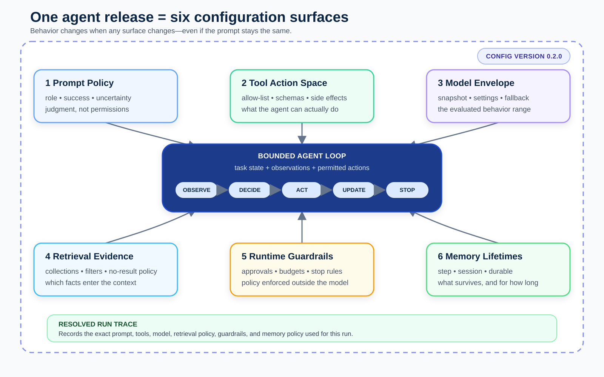

# The Six Configuration Surfaces of an Agent

*Part 2 of Agentic AI Engineering: turn an agent boundary into configuration you can review, test, and version.*

**Series navigation:** Previous: Part 1 — What Makes an AI Agent Different from a Chatbot? | Course index: Agentic AI Engineering | Next: Part 3 — Building a Minimal Tool-Using Agent

*Disclosure: This draft was developed with AI assistance. Its technical claims,
configuration example, and sources were checked during editorial preparation;
the named author remains responsible for the final publication.*

The first agent configuration I reviewed looked reassuringly small. It had a system prompt, a model name, and a list of tools. The team could explain every line.

Then we tried to answer a simple release question: “What changed, and is it safe to deploy?”

The agent searched the wrong documents, remembered a decision from another project, called a write-capable tool before approval, and produced different answers after a model update. None of those failures lived in the prompt. The system’s behavior was spread across code, environment variables, database settings, and defaults that no reviewer could see in one place.

This is why an agent needs more than a prompt file. It needs a **configuration contract**: a versioned description of the six surfaces that shape its behavior—prompts, tools, model, retrieval, guardrails, and memory.

In this article, you will turn an abstract boundary into one reviewable manifest,
trace a release request through every surface, and identify which changes require
new tests or a security review.

The six surfaces are not six independent knobs. They are six places where behavior can change. If you cannot point to the versioned value for each one, you cannot reliably explain which agent you tested or what changed between two releases.

## Reading Path

Read the six surface descriptions in order if this is your first agent
configuration. If you already operate model-backed services, begin with
**Configuration Is Resolved, Not Merely Read**, inspect the strict schema and
change-impact matrix, then use the release-evidence section as a production
checklist. Every path returns to the worked release-analyst manifest and the same
exercise artifact.

## Learning Outcomes

By the end of this lesson, you will be able to:

1. Explain how prompts, tools, model settings, retrieval, guardrails, and memory each influence agent behavior.
2. Distinguish policy from implementation defaults so reviewers can see the agent’s real operating contract.
3. Design a versioned configuration manifest that Part 3 can turn into a minimal tool-using agent.

## Before You Start

Part 1 ended with a boundary card: what the agent may observe, which actions it may take, what it may retain, when approval is required, and how it stops. That card describes intent. Configuration makes the intent executable and reviewable.

You should be able to read YAML and recognize a read-only versus mutating API.
Before continuing, look at your Part 1 boundary card and answer: which rule would
be most dangerous if it lived only in a prompt? Keep that rule visible while you
map it to the six configuration surfaces.

Suppose the boundary says, “The agent may read release notes and test results, but it must not promote a build without approval.” That sentence touches several surfaces at once:

- The prompt must tell the agent to distinguish analysis from authorization.
- The tool list must expose read operations and either omit promotion or place it behind an approval mechanism.
- Retrieval must restrict evidence to the correct project and release.
- Guardrails must reject an unapproved promotion request even if the model asks for it.
- Memory must not carry approval from a previous release.

If the restriction exists only in prose, the rest of the system can quietly disagree with it. A configuration contract forces the agreement into view.

## Mental Model

Treat an agent release as a six-sided configuration envelope around the bounded
control loop. Each side answers a different operational question:

- Prompts: what policy should guide the model's judgment?
- Tools: which actions are technically possible?
- Model: which evaluated behavior and settings are in use?
- Retrieval: which evidence may enter the context?
- Guardrails: which runtime rules are enforced around calls?
- Memory: which information survives, and for how long?

The tested unit is the resolved combination, not any single file. A prompt diff
cannot explain a retrieval-filter change, a new credential scope, or a model
alias that resolved to a different version.

## Configuration Is Resolved, Not Merely Read

The YAML file in a repository is rarely the complete configuration used by a
running service. Deployment overlays may change model identifiers, secret
bindings may select different credentials, a feature flag may expose another
tool, and a provider alias may resolve to a new model snapshot. If a trace records
only the base file, it records intent—not necessarily execution.

A useful resolution pipeline has four stages:

1. **Load declared configuration.** Read the version-controlled base and the
   explicitly selected environment overlay.
2. **Merge with documented precedence.** Decide which fields an overlay may
   replace and reject ambiguous or unknown keys.
3. **Bind runtime references.** Resolve prompt assets, credential references,
   tool implementations, model snapshots, retrieval collections, and guardrail
   policies without copying secret values into the manifest.
4. **Validate and record the result.** Validate the resolved object, serialize it
   canonically, hash it, and attach that hash plus component versions to every
   run trace.

The following framework-neutral pseudocode makes the resolution order visible:

```python
declared = load_yaml("agent-config.yaml")
overlay = load_yaml("environments/production.yaml")

merged = merge_strict(declared, overlay, allowed_overrides=PRODUCTION_OVERRIDES)
resolved = bind_references(
    merged,
    prompts=prompt_registry,
    tools=tool_registry,
    models=model_registry,
    credentials=credential_broker,
)

validate_schema(resolved)
validate_policy_consistency(resolved)

release = {
    "config_version": resolved["config_version"],
    "resolved_config_sha256": canonical_sha256(redact_secrets(resolved)),
    "component_versions": inventory_versions(resolved),
}
```

The merge must be **strict**. A generic deep merge can turn a safe list into an
unsafe one. Suppose the base configuration denies `promote_release`, while an
overlay replaces the entire `tools` object with a shorter object that simply
omits the deny-list. Did omission mean “inherit,” “clear,” or “use a default”?
There should be one documented answer, enforced by the loader.

Prefer replacement rules that can be reviewed field by field. Security-sensitive
fields—mutating tools, credential scopes, approval requirements, durable memory,
and retrieval tenant filters—should either be immutable in deployment overlays
or require a separately reviewed policy change. Convenience is not a good reason
to make the action boundary environment-dependent and invisible.

Resolved configuration also prevents alias ambiguity. `latest-capable-model` is
useful as an operator preference, but it is insufficient incident evidence. A run
should record both the requested alias and the exact snapshot selected. The same
principle applies to prompt aliases, tool packages, retrieval indexes, and
classifier policies.

## Surface 1: Prompts Define the Task Policy

Prompts describe the agent’s role, priorities, definitions, and response rules. They should answer questions such as: What does “done” mean? When should the agent ask for clarification? How should it report uncertainty? Which evidence belongs in the final answer?

Prompts are good at expressing judgment. They are a poor substitute for
permissions. “Never deploy without approval” is useful instruction, but it is not
an access-control system. Keep that instruction because it helps the model choose
correctly; enforce the same rule outside the model. OWASP recommends least-
privilege tool scopes, validation against user permissions and session context,
and human oversight for high-risk operations. OpenAI's Agents SDK separately
supports input, output, and per-tool guardrails, which reinforces the architectural
point: runtime enforcement belongs around model decisions, not only inside prose.

Store prompts as named, versioned assets rather than long strings embedded in application code. A reviewer should be able to compare `release-analyst-v2` with `release-analyst-v3` without searching through a request handler.

## Surface 2: Tools Define the Action Space

A tool is not merely a function the model can call. Its schema, credentials, validation, timeout, and side effects define what an agent can actually do.

The tool surface should record:

- a stable tool name and purpose;
- its input schema and validation rules;
- whether it is read-only or mutating;
- the credential scope used by the surrounding application;
- timeout, retry, and idempotency behavior;
- approval requirements and audit expectations.

Prefer narrow tools over general ones. `read_test_summary(release_id)` gives the agent less room to make a dangerous mistake than `run_shell(command)`. The narrower tool also produces a clearer trace: you know what operation was intended and which identifier controlled it.

In Part 3, we will implement the tool-call loop. For now, the important move is to treat the allowed tool set as a release artifact, not an incidental list assembled at runtime.

## Surface 3: The Model Defines a Behavior Envelope

The model surface includes the model identifier plus settings that affect generation, such as temperature, token limits, reasoning mode, and structured-output requirements when the provider supports them.

This surface is best understood as a **behavior envelope**, not a personality
switch. A model change can alter tool selection, instruction following, latency,
cost, context capacity, or output shape. Exact effects depend on the model and
evaluated task, so test them rather than assuming that a newer model is a drop-in
replacement. OpenAI's API compatibility guidance says prompting behavior may
change between model snapshots and recommends pinned model versions plus evals
for consistency. Anthropic's model lifecycle guidance likewise tells teams to
test replacements before a model's retirement.

Record the exact identifier accepted by your provider, not a team nickname such as `smart-model`. Also record the fallback policy. An invisible fallback can make an incident hard to reproduce because the configured model and the model that handled the request are different facts.

## Surface 4: Retrieval Defines the Evidence Window

Retrieval determines which external knowledge enters the agent’s working context. Its configuration includes source collections, filters, query strategy, result count, ranking or reranking, freshness rules, and citation requirements.

This surface is easy to hide behind one boolean: `rag_enabled: true`. That tells a reviewer almost nothing. Which repository? Which tenant? Which release? How old may a document be? What happens when results conflict or nothing relevant is found?

For our release analyst, retrieval should filter by project and release ID before semantic ranking. A semantically similar postmortem from another project may look relevant while being operationally wrong. Retrieval controls the evidence window; it does not guarantee that the evidence is true or sufficient.

Keep “no supporting evidence found” as a valid result. An agent that must always answer will often turn a retrieval miss into confident prose.

## Surface 5: Guardrails Enforce Runtime Policy

Guardrails are checks around the model and tools. They can validate inputs, reject unsafe tool arguments, limit budgets, require approval, inspect outputs, or stop a run after repeated failures.

Some guardrails are deterministic: a release ID must match a known pattern; a promotion tool requires an approval token; the agent may take no more than eight steps. Others may use classifiers or models and therefore need their own evaluation and failure policy.

Keep hard authorization rules deterministic whenever possible. The model may recommend an action, but application code should decide whether the caller and the current task are allowed to perform it. A denied action should become an observation the agent can report, not an invitation to find a less visible path.

## Surface 6: Memory Defines What Survives

Memory is the information that persists beyond the immediate model call. It may include structured task state, a short session summary, user preferences, or durable facts approved for later reuse.

The useful question is not “Does the agent have memory?” It is “Which facts survive, for how long, under which identity and scope?”

Separate at least three lifetimes:

1. **Step state** lasts inside one tool-use loop, such as the current release ID and remaining budget.
2. **Session state** lasts for the current task, such as documents already inspected and unresolved checks.
3. **Durable memory** survives across tasks, such as an approved preference or a stable project convention.

Do not place approvals, temporary permissions, or unverified retrieved claims in durable memory. For the release analyst, “release 2.4 was approved” must not become authority for release 2.5.

## Worked Example

We will configure a bounded release analyst. Its job is to inspect a release candidate, summarize changes and test evidence, and prepare a recommendation. It may not deploy anything.

Here is a compact manifest:

```yaml
schema_version: 1
agent_id: release-analyst
config_version: 0.2.0

prompt:
  id: release-analyst-v2
  success_definition: evidence-backed recommendation produced

model:
  id: provider-model-snapshot
  temperature: 0
  max_output_tokens: 1800
  fallback: none

tools:
  allow:
    - read_release_notes
    - read_test_summary
    - request_clarification
  deny:
    - promote_release

retrieval:
  collections: [release-notes, test-reports]
  required_filters: [project_id, release_id]
  max_results: 8
  require_evidence_for_claims: true

guardrails:
  max_steps: 8
  max_tool_failures: 2
  mutation_policy: deny
  on_missing_evidence: report_unknown

memory:
  step: [project_id, release_id, remaining_steps]
  session: [documents_read, open_questions]
  durable: []
```

Trace one request through the surfaces: “Review release 2.5 for Project North.” The prompt defines a recommendation—not deployment—as success. The model may choose which read tool to call first. The tool allow-list gives it only three possible actions. Retrieval filters prevent Project South documents from entering the evidence set. Guardrails stop the run after eight steps or two tool failures. Memory keeps the release ID during the task but preserves nothing afterward.

Now imagine changing only `mutation_policy` from `deny` to `approval_required` and adding `promote_release` to the tool list. That is not a minor configuration cleanup. It expands the action boundary and should trigger security review, new tests, and a deliberate version change.

A readable diff is the point. When behavior is separated into surfaces, reviewers can ask the right question for each change instead of re-reading one enormous prompt and hoping the important behavior is inside it.

## Treat Configuration Changes Like Code Changes

Use a stable schema and validate it before the agent starts. Reject unknown fields rather than silently ignoring a misspelled guardrail. Record the resolved configuration with each run so a trace can answer, “Which prompt, model, tool set, retrieval policy, guardrails, and memory policy produced this result?”

Version numbers do not remove the need for judgment, but they make judgment
visible. Semantic Versioning formally applies when software declares a public
API, so do not copy its major/minor/patch rules blindly onto an agent. Define your
configuration's compatibility contract first. Within that contract, a wording
correction may be a patch, a new read-only tool may be a minor change, and a
mutating tool or wider memory scope may deserve a major version plus fresh risk
review.

Secrets do not belong in the manifest. Store credential references, not credential values. The manifest should say which identity or secret binding a tool expects while the deployment environment supplies the secret.

## Validate the Contract with a Strict Schema

Shape validation cannot prove that an agent behaves correctly, but it can stop a
surprising number of release mistakes before a model is called. The schema below
requires every surface, rejects unknown top-level fields, prevents an empty tool
policy, and makes the absence of a mutation policy an error.

```json
{
  "$schema": "https://json-schema.org/draft/2020-12/schema",
  "type": "object",
  "additionalProperties": false,
  "required": [
    "schema_version",
    "agent_id",
    "config_version",
    "prompt",
    "model",
    "tools",
    "retrieval",
    "guardrails",
    "memory"
  ],
  "properties": {
    "schema_version": { "const": 1 },
    "agent_id": { "type": "string", "minLength": 1 },
    "config_version": {
      "type": "string",
      "pattern": "^[0-9]+\\.[0-9]+\\.[0-9]+$"
    },
    "prompt": {
      "type": "object",
      "additionalProperties": false,
      "required": ["id", "success_definition"],
      "properties": {
        "id": { "type": "string", "minLength": 1 },
        "success_definition": { "type": "string", "minLength": 10 }
      }
    },
    "model": {
      "type": "object",
      "additionalProperties": false,
      "required": ["id", "temperature", "max_output_tokens", "fallback"],
      "properties": {
        "id": { "type": "string", "minLength": 1 },
        "temperature": { "type": "number", "minimum": 0 },
        "max_output_tokens": { "type": "integer", "minimum": 1 },
        "fallback": { "type": ["string", "null"] }
      }
    },
    "tools": {
      "type": "object",
      "additionalProperties": false,
      "required": ["allow", "deny"],
      "properties": {
        "allow": {
          "type": "array",
          "minItems": 1,
          "uniqueItems": true,
          "items": { "type": "string" }
        },
        "deny": {
          "type": "array",
          "uniqueItems": true,
          "items": { "type": "string" }
        }
      }
    },
    "retrieval": {
      "type": "object",
      "additionalProperties": false,
      "required": [
        "collections",
        "required_filters",
        "max_results",
        "require_evidence_for_claims"
      ],
      "properties": {
        "collections": { "type": "array", "minItems": 1 },
        "required_filters": { "type": "array", "minItems": 1 },
        "max_results": { "type": "integer", "minimum": 1 },
        "require_evidence_for_claims": { "type": "boolean" }
      }
    },
    "guardrails": {
      "type": "object",
      "additionalProperties": false,
      "required": [
        "max_steps",
        "max_tool_failures",
        "mutation_policy",
        "on_missing_evidence"
      ],
      "properties": {
        "max_steps": { "type": "integer", "minimum": 1 },
        "max_tool_failures": { "type": "integer", "minimum": 0 },
        "mutation_policy": {
          "enum": ["deny", "approval_required"]
        },
        "on_missing_evidence": {
          "enum": ["report_unknown", "ask_user", "stop"]
        }
      }
    },
    "memory": {
      "type": "object",
      "additionalProperties": false,
      "required": ["step", "session", "durable"],
      "properties": {
        "step": { "type": "array", "uniqueItems": true },
        "session": { "type": "array", "uniqueItems": true },
        "durable": { "type": "array", "uniqueItems": true }
      }
    }
  }
}
```

There are two important limits. First, JSON Schema validates structure, types,
and local constraints; it does not know whether `release-notes` is the correct
collection for Project North. Second, some policies span fields. If
`mutation_policy` is `deny`, a consistency validator should reject any mutating
tool in the allow-list even though both fields are individually valid.

Treat the checks as layers:

- schema validation catches missing, misspelled, and malformed configuration;
- consistency validation checks relationships between surfaces;
- permission tests verify the deployed identity and tool enforcement;
- behavioral evaluations measure what the resolved agent actually does.

## Configuration Changes Invalidate Evidence

The six surfaces interact. A change that appears local can invalidate evidence
collected elsewhere, so review the dependency rather than only the edited line.

| Changed surface | Example change | Main risk | Minimum evidence to repeat |
|---|---|---|---|
| Prompt | New definition of “ready” | Completion decisions change | Task-success, abstention, and contradiction cases |
| Tools | Add `promote_release` | Action boundary expands | Schema, authorization, approval, idempotency, and audit tests |
| Model | Move to another snapshot | Tool choice or output shape changes | Full behavioral suite plus latency and cost comparison |
| Retrieval | Add a collection or loosen a filter | Wrong-tenant or stale evidence enters context | Relevance, provenance, isolation, freshness, and missing-evidence tests |
| Guardrails | Replace deny with classifier review | False negatives permit unsafe actions | Adversarial, bypass, threshold, and fail-closed tests |
| Memory | Persist recommendations across sessions | Stale or cross-user state influences a task | Isolation, expiration, deletion, provenance, and replay tests |

Now consider a cross-surface failure. The team adds a new model snapshot that
produces strictly valid tool JSON, so the schema tests pass. The new model is
also more willing to call tools and reaches `request_clarification` less often.
Retrieval misses are therefore converted into confident recommendations. Nothing
in the model field alone reveals the problem: it appears only when model behavior,
the missing-evidence guardrail, and the retrieval test set are evaluated together.

Another interaction appears when a tool schema changes. Renaming
`release_identifier` to `release_id` may require updates to tool descriptions,
few-shot examples, validation fixtures, and any prompt text that names the old
parameter. The executable function can be backward compatible while the model's
tool-selection behavior still regresses.

The release review should therefore produce an **evidence impact set**: the list
of tests, eval datasets, permission checks, and platform previews made stale by a
diff. A green schema check proves that the object is well formed. It does not
prove that yesterday's evaluation still applies.

## Build a Release Evidence Ladder

Chip Huyen's platform analysis grows architecture from a simple model call and
adds components when their value justifies their cost. Use the same progression
for release evidence. Start with the cheapest checks and promote the candidate
only when each layer passes.

1. **Static validation:** parse the manifest, validate the schema, reject secrets,
   verify referenced assets, and compute the resolved configuration hash.
2. **Component tests:** test each tool with valid and invalid parameters, verify
   retrieval isolation, exercise guardrail boundaries, and test memory expiry.
3. **Offline behavioral evaluation:** replay representative tasks and known
   failures. Measure task success, unsupported-claim rate, correct tool and
   parameter selection, unnecessary calls, step count, latency, and cost.
4. **Shadow evaluation:** send sampled production requests to the candidate
   without permitting side effects. Compare decisions and traces against the
   current release.
5. **Constrained canary:** expose a small share of traffic with mutating tools
   still denied or approval-gated. Monitor errors, denials, retries, latency,
   cost, and user corrections.
6. **Promotion or rollback:** promote only the exact resolved hash that passed.
   Keep the previous hash and its dependencies available for rollback.

This ladder prevents “we tested the prompt” from becoming release evidence for a
different resolved system. It also makes rollback precise. Reverting a Git commit
is insufficient if a provider alias, retrieval index, credential policy, or
external prompt asset changed independently.

Eugene Yan's production-pattern writing treats evaluations and defensive user
experience as foundational rather than late additions. For this release analyst,
defensive behavior includes reporting missing evidence, asking a clarifying
question, and exposing a denied action without pretending the task succeeded.
Those outcomes belong in the evaluation dataset alongside successful reviews.

## Visual Explanation

The diagram shows the bounded agent loop and six surrounding control surfaces. The version boundary marks the complete tested release; the run trace records its resolved configuration.



Figure 1: An agent release is the combined, versioned state of six behavior
surfaces—not just a prompt and model name. A behavior-changing diff in any panel
can invalidate the release's previous evidence.

## Tested Environment

The worked YAML manifest was parsed with Python 3.12.13 and PyYAML 6.0.3 on
2026-09-02. The displayed JSON Schema was checked as a valid Draft 2020-12 schema
and used with `jsonschema` 4.26.0 to require the six surfaces and reject unknown
top-level fields. The displayed sample passed.
Deleting `guardrails` produced the expected validation error; adding a misspelled
`guardrail` field also failed because the schema disabled additional properties.
Adding a mutating tool while leaving `mutation_policy: deny` passed structural
validation, as expected, and demonstrates why the separate cross-surface
consistency validator is required.

This check verifies the manifest's shape, not whether the agent is safe or useful.
Behavioral evals, permission tests, and failure-path tests remain separate release
evidence.

## Exercise

Take the boundary card you created in Part 1 and convert it into `agent-config.yaml`. Use the worked example as a shape, but replace its values with your agent’s actual goal and limits.

Your manifest must include:

1. one prompt identifier and a one-line success definition;
2. one exact model identifier plus explicit generation settings;
3. an allow-list of two or three narrow tools, marking any mutating tool;
4. retrieval sources, filters, result limits, and missing-evidence behavior;
5. at least three deterministic guardrails, including a step limit;
6. separate step, session, and durable memory fields;
7. a schema version and configuration version.

Then write a five-line change note for one hypothetical update. Name the surface changed, the old value, the new value, the risk introduced, and the validation required.

**Expected output:** one valid YAML file and one Markdown change note. A strong submission makes every Part 1 boundary visible, contains no secrets, denies or gates mutating actions, scopes retrieval by task identity, keeps temporary approval out of durable memory, and identifies which tests must run before the changed configuration is released.

Keep both files. Part 3 will load this manifest, expose three local tools, and implement the smallest useful tool-call loop around it.

## Check Your Work

Your package is ready for Part 3 when:

- all six surfaces have explicit values rather than inherited, undocumented
  defaults;
- the prompt success definition does not claim authority that the tools deny;
- every mutating tool is denied or linked to an approval rule;
- the exact model identifier and fallback behavior are visible;
- retrieval filters include the task identity needed to prevent cross-project
  evidence;
- step, session, and durable memory have different lifetimes;
- the schema rejects a missing required surface and an unknown misspelled field;
- the change note names the tests invalidated by the hypothetical change.

## Retrieval Practice

Answer without looking back at the six surface descriptions:

1. Which surface defines possible actions, and which surface decides whether a
   requested action may execute now?
2. Why is a model alias insufficient evidence for reproducing an earlier run?
3. What is the difference between retrieval scope and memory scope?
4. Which configuration changes would force you to repeat authorization tests?

Transfer prompt: choose a non-agent system—such as a deployment pipeline or data
importer—and apply the six-surface envelope. Which surfaces collapse into ordinary
application configuration, and which remain useful review boundaries?

## Recap

An agent’s behavior comes from six configuration surfaces: prompts define task policy, tools define possible actions, the model defines a behavior envelope, retrieval defines the evidence window, guardrails enforce runtime policy, and memory defines what survives.

Treat the six surfaces as one versioned contract. Validate its schema, record the resolved configuration with each run, and review boundary-expanding changes with the seriousness you would apply to code that receives new permissions.

The prompt still matters. It simply stops carrying responsibilities it cannot safely enforce.

## Sources

- [OpenAI Agents SDK: Agents and Configuration](https://openai.github.io/openai-agents-python/agents/)
- [OpenAI Agents SDK: Guardrails](https://openai.github.io/openai-agents-python/guardrails/)
- [OpenAI API: Backward Compatibility and Pinned Model Versions](https://platform.openai.com/docs/api-reference/backward-compatibility)
- [Anthropic: Model Deprecations and Migration Testing](https://docs.anthropic.com/en/docs/about-claude/model-deprecations)
- [OWASP: LLM Prompt Injection Prevention Cheat Sheet](https://cheatsheetseries.owasp.org/cheatsheets/LLM_Prompt_Injection_Prevention_Cheat_Sheet.html)
- [JSON Schema: Object Validation](https://json-schema.org/understanding-json-schema/reference/object)
- [Semantic Versioning 2.0.0](https://semver.org/)
- [Chip Huyen: Agents](https://huyenchip.com/2025/01/07/agents.html)
- [Chip Huyen: Building a Generative AI Platform](https://huyenchip.com/2024/07/25/genai-platform.html)
- [Eugene Yan: Patterns for Building LLM-based Systems and Products](https://eugeneyan.com/writing/llm-patterns/)

## Next Lesson

Part 3, **Building a Minimal Tool-Using Agent**, turns this manifest into code. We will define three narrow tool schemas, execute a tool-call loop, feed results back into state, and stop without hiding failures.

**Series navigation:** Previous: Part 1 — What Makes an AI Agent Different from a Chatbot? | Course index: Agentic AI Engineering | Next: Part 3 — Building a Minimal Tool-Using Agent
