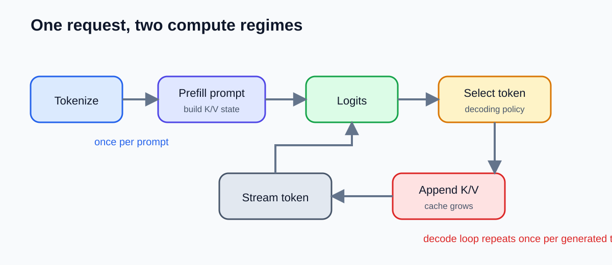

# What Actually Happens When an LLM Generates One Token?

This article was developed with AI assistance from a source-checked outline and a tested companion experiment. Praveen Kumar remains responsible for verifying every claim and approving any public version.

When an LLM application feels slow, “the model is slow” is almost never a useful diagnosis. Did the request wait in a queue? Did a long prompt delay the first token? Did generation begin quickly but decode slowly? Did the server run out of room for key-value caches and reduce its batch? Each symptom belongs to a different part of the path.

The smallest useful unit for understanding that path is one generated token. We will follow it from text to token identifier, through prompt processing, attention, logits, selection, cache growth, and streaming. Then we will reproduce the important mechanism in a tiny NumPy model. The model is intentionally small enough to inspect. It is not a production benchmark.

Series navigation: Previous: none. Course index: Golden technical guides. Next: Continuous batching and request scheduling.

## Reading Path

If you need the conceptual map, read through “One response contains two different workloads.” If you build systems, continue through the cache calculation and latency diagnosis. If you learn by running code, jump to the worked example, execute it, and return to the production boundaries before interpreting the measurements.

## Learning Outcomes

After working through the article, you can:

1. Trace one request through tokenization, prefill, next-token selection, cached decoding, and streaming.
2. Distinguish time to first token from inter-token latency and justify which metric matches a user-visible symptom.
3. Implement and test a small key-value cache whose cached logits match full recomputation.
4. Estimate cache memory and explain why context length, concurrency, and cache layout affect serving capacity.

## Before You Start

You should be comfortable reading Python and multiplying matrix dimensions. You do not need to know GPU kernels or train a neural network.

Recall one familiar API request. Where can time accumulate before application code returns a response: network transit, authentication, queueing, database work, computation, serialization, or another downstream call? Keep that decomposition in mind. An LLM request has the same need for boundaries, but generation adds an iterative loop and per-request state that grows with the sequence.

## Mental Model

Use this latency equation as the map:

\[
T_{total}=T_{network}+T_{queue}+T_{prefill}+\sum_{i=1}^{N}T_{decode,i}+T_{stream}
\]

It is an accounting model, not a promise that the terms are independent. Batching can change queueing and compute. Network backpressure can affect streaming. Cache pressure can change scheduling. Still, naming the terms prevents us from treating every delay as one opaque “model latency.”

The request has two compute regimes. **Prefill** processes the supplied prompt and creates reusable attention state. **Decode** adds generated tokens one at a time, reusing earlier state. The first visible token cannot arrive until the request has passed queueing, prefill, the first next-token decision, and enough transport work to reach the client. Later tokens mostly expose repeated decode and streaming behavior.



Figure 1: Prefill prepares prompt state once; the decode loop selects, caches, and streams each generated token.

## Start at the boundary: the request reaches a serving system

An application rarely calls a matrix multiplication directly. It calls a serving endpoint. Before model execution, a gateway may authenticate the caller, enforce token or spending limits, normalize the request, choose a model, and attach tracing metadata. A scheduler then decides when and with which other requests this work runs.

This matters because an idle-looking model can still produce a poor user experience if requests wait. Conversely, a busy accelerator can be healthy if batching produces good throughput while tail latency stays within the product objective. “GPU utilization” is therefore not a complete service-level metric.

Suppose a user reports that output sometimes takes five seconds to begin, but streams smoothly afterward. Inspect queue duration and prefill duration before changing the sampling algorithm. If output begins immediately but pauses between tokens, inspect decode scheduling, per-token latency, network flushing, and client rendering. The two experiences may have the same total duration and require different fixes.

## Text becomes token identifiers

The model does not receive words or characters directly. A tokenizer maps text into a sequence of integer identifiers from a fixed vocabulary. The identifiers are lookup keys, not numerical meanings: token 900 is not inherently “more” than token 90.

Tokenization affects more than billing. Prompt length determines how many positions prefill must process and how much state the cache must retain. Languages, whitespace, source code, identifiers, and formatting can produce different token counts for similar character counts. That is why a character limit is a poor substitute for recording actual prompt tokens.

After tokenization, an embedding table maps each identifier to a vector. Positional information is also incorporated because attention alone needs a way to distinguish order. Exact positional mechanisms vary across model families; the durable idea is that each position obtains a representation the model can process.

## One response contains two different workloads

During prefill, the model receives all prompt positions. Within each layer, it projects representations into queries, keys, and values. In simplified single-head notation:

\[
Q=XW_Q,\quad K=XW_K,\quad V=XW_V
\]

Attention compares queries with keys, applies scaling and a causal mask, normalizes scores, and mixes values:

\[
\operatorname{Attention}(Q,K,V)=\operatorname{softmax}\left(\frac{QK^T}{\sqrt{d}}+M\right)V
\]

The causal mask \(M\) prevents a position from reading future positions. Production models add multiple heads, normalization, feed-forward blocks, residual connections, positional mechanisms, and many implementation optimizations. The equation is useful because it identifies what can be reused: keys and values already computed for previous positions do not change merely because a new token is appended.

Prefill can process prompt positions with substantial parallelism, although attention work and memory increase with sequence length. Decode is different. Token \(i+1\) depends on the token selected at step \(i\), so generation has a sequential dependency across output positions. A server can batch decode work across requests, but it cannot ordinarily compute an unknown future token before choosing its predecessor.

This distinction explains a common observation. Increasing prompt length often hurts the delay before output begins. Increasing requested output length adds more decode iterations and extends total generation after the stream begins. Both consume resources, but on different axes.

## From the final hidden state to one selected token

At the last model layer, the representation for the current final position is projected to one score per vocabulary item. These raw scores are logits. A softmax can convert them into a probability distribution, but the model has not yet “chosen” text.

A decoding strategy performs that choice. Greedy decoding takes the largest logit. Sampling draws according to a modified distribution, often using temperature, top-k, top-p, repetition handling, or application constraints. Beam search and constrained decoding follow other procedures. This boundary is important: the neural network produces scores; the decoding policy turns scores into a token decision.

Selection changes output behavior, not the underlying fact that another forward step is needed after the token is appended. A low temperature does not eliminate decoding cost. Streaming does not eliminate it either. Streaming lets the client observe decisions earlier; it does not make the model produce all future tokens at once.

The selected identifier is decoded back toward text. Token-to-text boundaries do not always align with human-readable words, so servers and clients may buffer bytes before displaying valid text. The serving layer sends a chunk, the client renders it, and the loop continues until an end token, length cap, stop sequence, cancellation, error, or another policy ends generation.

## The KV cache stores projections, not the original prompt

Without reuse, every decode step could project all earlier positions into keys and values again. The key-value cache retains those tensors layer by layer. When one new token arrives, the model computes its new key and value, appends them to cached state, and lets the new query attend over the accumulated keys and values.

This is the core invariant we can test:

> If the model, sequence, positions, numerical behavior, and attention semantics are identical, cached decoding and full recomputation should produce equivalent next-token logits.

The cache is not a semantic memory or conversation database. It does not store neat facts extracted from the prompt. It stores numerical intermediate state needed by attention. Deleting or corrupting values changes later logits even if the visible token identifiers remain unchanged.

For a conventional cache, a useful memory estimate is:

\[
B_{cache}\approx 2LTH_{kv}D_hB_e
\]

Here \(L\) is layer count, \(T\) cached tokens, \(H_{kv}\) key-value heads, \(D_h\) head dimension, and \(B_e\) bytes per element. The factor two counts keys and values.

Take an illustrative configuration: 32 layers, 4,096 cached tokens, 32 KV heads, head dimension 128, and two bytes per value. The estimate is exactly 2 GiB for one sequence. This is not a claim about a named model; grouped-query attention, multi-query attention, quantized caches, paging, metadata, padding, and implementation details change the result. The calculation exposes the direction: double cached tokens or concurrent sequences and the associated cache demand grows accordingly.

This is why a loaded model is not the complete memory story. Model weights are comparatively stable. Active requests create dynamic state with different lengths and lifetimes. The PagedAttention work identified fragmentation and redundant duplication as important limits in evaluated serving systems and designed block-level cache management to reduce waste. Treat its reported throughput as evidence from those evaluated settings, not a universal multiplier.

## Worked Example

The companion project implements a single-head causal-attention model with fixed random weights. It is deliberately missing most features of a modern LLM. That simplicity lets us inspect the invariant without downloading a model or requiring a GPU.

Install and run it:

```bash
cd medium/examples/golden-one-token
python -m pip install -r requirements.txt
python -m unittest -v
python one_token.py --benchmark results/benchmark.csv
```

The prefill path projects the entire prompt, builds a causal attention matrix, returns next-token logits, and stores keys and values:

```python
def prefill(self, prompt):
    queries, keys, values = self.project(prompt)
    scores = queries @ keys.T / np.sqrt(self.d_model)
    causal = np.triu(np.full(scores.shape, -np.inf), k=1)
    attention = self.softmax(scores + causal)
    hidden = attention @ values
    return hidden[-1] @ self.wo, Cache(keys=keys, values=values)
```

Decode projects only the new token, appends its key and value, and evaluates its query against the accumulated cache:

```python
def decode_one(self, token_id, cache):
    query, new_key, new_value = self.project(np.array([token_id]))
    keys = np.concatenate([cache.keys, new_key], axis=0)
    values = np.concatenate([cache.values, new_value], axis=0)
    attention = self.softmax(query @ keys.T / np.sqrt(self.d_model))
    logits = (attention @ values)[0] @ self.wo
    return logits, Cache(keys=keys, values=values)
```

The decisive test runs one cached step and compares its logits with full recomputation over the extended sequence:

```python
cached, _ = model.decode_one(token, cache)
recomputed = model.next_logits_recompute(np.append(prompt, token))
np.testing.assert_allclose(cached, recomputed, rtol=1e-12, atol=1e-12)
```

On the recorded run, the maximum absolute difference was `2.776e-17`, near floating-point precision. The failure fixture replaces cached values with zeros and verifies that the same equality assertion fails. A test that only checks the happy path could pass even if it never proved the cache matters; deliberate corruption makes the dependency observable.

## Tested Environment

The experiment was verified on 2026-09-03 using Python 3.12.13, NumPy 2.1.3, Linux 6.18.35 x86-64, and an AMD EPYC 9V74 CPU. Three unit tests passed.

The recorded median toy timings were:

| Experiment | Prompt tokens | Output steps | Median ms |
|---|---:|---:|---:|
| Prefill | 16 | 0 | 0.0410 |
| Prefill | 64 | 0 | 0.1419 |
| Prefill | 256 | 0 | 1.4479 |
| Prefill | 1,024 | 0 | 24.1330 |
| Cached generation | 128 | 1 | 0.3595 |
| Cached generation | 128 | 8 | 0.6278 |
| Cached generation | 128 | 32 | 1.3909 |
| Cached generation | 128 | 64 | 2.4019 |

The useful result is not the absolute milliseconds. NumPy, CPU caches, matrix libraries, background work, small tensor overhead, warm-up, and the toy architecture all influence them. The experiment demonstrates how to isolate axes: hold output at zero while varying prompt length, then hold the prompt constant while varying decode steps. A production benchmark must repeat that discipline on the actual model, hardware, server, batching policy, and workload distribution.

## Diagnose symptoms with the right measurement

**Time to first token (TTFT)** covers the experience before the first streamed token becomes visible. Define its boundaries precisely in your telemetry. It may include gateway and queue time, or you may record those separately. Without definitions, two dashboards can use the same label for different intervals.

**Inter-token latency** measures delay between generated tokens or chunks. **Tokens per second** is often derived over a period, but averages can hide pauses and tail behavior. Record distributions, not only means. A p50 that looks excellent can coexist with a painful p99.

Use a symptom-to-hypothesis loop:

| Symptom | First measurements | Candidate causes | Controlled follow-up |
|---|---|---|---|
| Slow start, smooth stream | queue, prompt tokens, prefill, TTFT | queue saturation, long prompts, cold path | hold output length constant; vary prompt length and concurrency |
| Fast start, slow stream | inter-token latency, decode batch, network flush | decode contention, scheduling, client buffering | hold prompt constant; vary output and concurrency |
| Degrades with simultaneous users | queue depth, active tokens, cache occupancy | capacity or cache pressure | sweep concurrency with fixed request shapes |
| Out-of-memory at long context | cache bytes, fragmentation, batch size | insufficient headroom or layout waste | calculate expected cache, compare allocated and useful bytes |
| Cost grows unexpectedly | input/output tokens, retries, discarded generations | long context, excessive output, retry policy | attribute usage by request and failure outcome |

Do not “optimize latency” as one number. Decide whether the product values a quick acknowledgement, steady reading pace, total completion, throughput, or cost. A support assistant may prioritize first response; a batch summarizer may prioritize total throughput. The correct objective depends on the user job.

## Where the toy model stops being accurate

The experiment uses one attention head, one attention operation, greedy selection, fixed random weights, and CPU NumPy. It omits normalization, multilayer blocks, feed-forward networks, rotary or other positional handling, grouped-query attention, quantization, GPU kernels, tensor parallelism, continuous batching, prefix sharing, cache eviction, speculative decoding, and network serving.

Its cache concatenation copies arrays, while production systems manage memory much more carefully. Its benchmark uses small synthetic sequences, not a workload distribution. It measures no queue. It reports no model quality. It cannot tell you whether vLLM, TensorRT-LLM, Text Generation Inference, llama.cpp, or a hosted API is best for your environment.

Those omissions are a feature of the lesson only because they are explicit. The code isolates the causal relationship we need: reuse versus recomputation. After that invariant is understood, production mechanisms can be added without becoming mysterious names.

## Common mistakes

The first mistake is saying “prefetch” when you mean **prefill**. Prefetching is a broader systems technique; prefill is the prompt-processing phase used in LLM inference discussions.

The second is saying the cache stores tokens. Tokens remain identifiers in the sequence; the attention cache stores key and value tensors derived at each layer.

The third is using a throughput improvement from a paper as a capacity promise. Reproduce the relevant workload or qualify the result as belonging to the evaluated setting.

The fourth is benchmarking prompt and output length simultaneously. If both change, you cannot tell whether first-token or repeated-decode work caused the difference.

The fifth is enabling streaming and declaring latency solved. Streaming can improve perceived responsiveness while total compute, cost, and slow decode remain unchanged.

## Exercise

Extend the companion project with a `generate_cached(prompt, max_new_tokens)` function and a `generate_recomputed` reference. Run both for eight output steps.

Expected output:

- both functions produce the same greedy token sequence;
- cached and recomputed logits agree at every step within the declared tolerance;
- a failing test demonstrates that removing the newest cached key or value breaks equivalence;
- a CSV records separate experiments for prompt length and output length.

Then calculate cache memory for two configurations: conventional multi-head KV and grouped-query KV with one quarter as many KV heads. State assumptions and compare the result. Do not claim the ratio describes end-to-end server memory because weights, activations, allocator state, and metadata remain outside the calculation.

## Check Your Work

- The reference path recomputes from the entire extended sequence.
- The cached path projects only the appended token during decode.
- Tests compare logits, not only selected tokens; two different distributions can share an argmax.
- The negative fixture fails for the intended reason.
- Timing measurements use repeated runs and report a robust statistic.
- Absolute toy timings are not described as production results.
- The cache worksheet names layers, tokens, KV heads, head dimension, and bytes per value.

## Retrieval Practice

1. Why does a long prompt usually affect the first visible token differently from a long answer?
2. What does the KV cache contain, and why can previous keys and values be reused?
3. Why is matching greedy output weaker evidence than matching logits?
4. Which measurements would you inspect when output starts quickly but pauses afterward?

Transfer prompt: apply the latency equation to a retrieval-augmented generation request. Add query rewriting, retrieval, reranking, and context construction as explicit terms. Decide which spans must be recorded to distinguish retrieval delay from model prefill.

## Recap

An LLM response is not one atomic model call. Text becomes identifiers and vectors. Prefill processes the prompt and builds reusable state. The final hidden representation becomes vocabulary logits. A decoding policy selects one token. The new token is appended, its key and value extend every layer's cache, and decode repeats. Serving and streaming surround this computation with scheduling, capacity, network, and client behavior.

Once you preserve these boundaries, operational questions become testable. Slow start points toward queueing or prompt work. Slow continuation points toward decode or delivery. Long contexts create dynamic cache pressure. Cached/full recomputation equivalence provides a correctness invariant. Measurements become useful when one workload axis changes at a time.

## Next Lesson

The next guide will add multiple concurrent requests and a small scheduler. That will show why batching can improve throughput while queueing and tail latency become harder to control.

## Sources

- [Vaswani et al., Attention Is All You Need](https://arxiv.org/abs/1706.03762)
- [Kwon et al., Efficient Memory Management for Large Language Model Serving with PagedAttention](https://arxiv.org/abs/2309.06180)
- [Hugging Face: Caching](https://huggingface.co/docs/transformers/cache_explanation)
- [Hugging Face: Generation strategies](https://huggingface.co/docs/transformers/generation_strategies)
- [Chip Huyen: Building a Generative AI Platform](https://huyenchip.com/2024/07/25/genai-platform.html)
- [Andrej Karpathy: microgpt](https://karpathy.github.io/2026/02/12/microgpt/)
